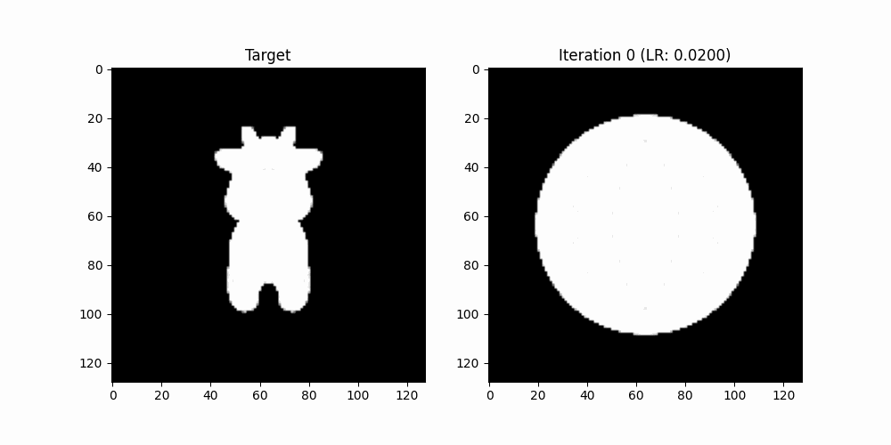
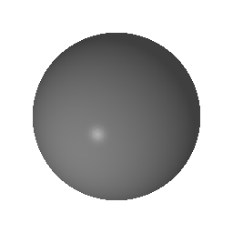

# 实验报告：基于可微光栅化的三维网格形变与优化实现

## 一、项目介绍

本实验旨在深入理解计算机图形学中的**可微渲染（Differentiable Rendering）**技术。通过将传统的硬光栅化改进为**软光栅化（Soft Rasterization）**，解决离散几何体在投影边界处梯度消失的问题。实验的核心任务是利用 PyTorch3D 框架，将一个初始的“等值球体（Ico-sphere）”通过梯度下降算法，在多视角剪影损失（Silhouette Loss）的驱动下，逐渐拟合优化成“目标奶牛（Cow Mesh）”的形状。

## 二、项目架构

本项目基于 Python 科学计算栈与深度学习框架构建：

* **深度学习框架**: PyTorch (处理梯度计算与参数更新)。
* **三维算子库**: PyTorch3D (提供可微光栅化器、Mesh 数据结构及几何损失函数)。
* **渲染管线**:
* `FoVPerspectiveCameras`: 透视投影相机系统。
* `MeshRasterizer`: 软光栅化器，负责计算三角形对像素的影响。
* `SoftSilhouetteShader`: 计算带透明度过渡的剪影图。

* **可视化与存储**: Matplotlib 用于中间过程展示，`shutil` 与 `os` 用于自动化文件管理。

## 三、代码逻辑

代码实现的逻辑分为五个主要阶段：

1. **数据归一化**: 加载目标模型，通过显式搬运数据至同一 `device` 并进行中心化缩放，确保球体与目标初始重合且位于相机视野中心。
2. **多视角设置**: 在三维空间中设置 20 个采样视角（环绕 360 度），渲染出目标剪影图作为 Ground Truth，利用多视角约束防止单向塌陷。
3. **参数化形变**: 将球体的顶点位置设为优化参数 `deform_verts`，使用 `Adam` 优化器结合 `StepLR` 学习率调度器。
4. **两阶段损失优化**:
* **重塑期 (0-300步)**: 调高剪影损失权重，降低正则化阻力，允许网格进行大幅度拓扑拉伸以捕捉四肢、耳朵等高频细节。
* **精修期 (300-600步)**: 自动衰减学习率，加强拉普拉斯平滑（Laplacian Smoothing）约束，消除由于强力形变产生的表面毛刺。

5. **动态可视化**: 迭代过程中使用 `cmap='gray'` 实时对比剪影，并将演化过程自动保存至 `cow_evolution_long` 文件夹。

## 四、实现功能

* **软剪影梯度回传**: 成功通过调节 `sigma` 参数建立了“引力场”，实现了非重叠区域的梯度有效传导。
* **网格正则化**: 应用拉普拉斯和平滑惩罚，保证了在高倍形变下网格不发生拓扑崩坏（如三角形自相交）。
* **学习率动态调度**: 通过分段学习率策略，兼顾了形变的速度（早期）与形状的精度（后期）。
* **自动化结果分析**: 实现了过程图片自动保存与 3D 模型导出，方便对“演化史”进行回溯。

## 五、实验结果展示

实验记录了球体逐渐拉长、长出四肢和头部的全过程。

* **初始阶段**: 模型呈现球形，处于奶牛躯干中心。
* **中期形变**: 顶点受多视角梯度牵引，明显向四肢和头部延伸。
* **最终结果**: 预测剪影与目标高度重合，奶牛特征明显，表面平滑且拓扑结构健康。

## 结论

通过本次实验，我深刻理解了可微渲染在“从图像反推几何”任务中的潜力。实验证明，合理配置**软光栅化参数**与**动态正则化权重**是优化成败的关键。克服了初期模型不动的“土豆”困境后，通过长周期优化与学习率调度，成功实现了从球体到复杂生物网格的自动化捏形。

# 纹理联合优化进阶实验

## 一、 实验目的与背景

本进阶实验旨在深入研究三维计算机图形学中的逆向渲染（Inverse Rendering）问题。在前期实现基于黑白剪影（Silhouette）优化三维几何形状的基础上，本实验进一步进阶到“联合纹理与形变优化（Joint Texture and Shape Optimization）”。

通过结合 `SoftPhongShader` 与可微几何形变流管线，实验从一个无任何特征的初始球体拓扑出发，仅通过输入的 20 个多视角真值（Ground Truth）图像，在不依赖任何三维真值几何的条件下，同时反推并联合拟合出目标对象的**精准三维几何形态**以及**高保真表面纹理（RGB颜色分布）**。

---

## 二、 核心进阶知识点解析

为了实现颜色与形状的联合收敛，本实验在底层图形学管线上相较于基础版进行了重构，引入了以下核心进阶技术：

### 1. 可微着色器（SoftPhongShader）与辐射度梯度回传

传统的 Phong 着色器由于其内部的光栅化边界和阶跃函数（Step Function），在数学上是不可微的（梯度为零或无穷大）。
本实验引入了 **SoftPhongShader**，它基于 Soft Rasterizer 理论，引入了模糊半径（$\sigma$）和概率图。它不仅能输出表示前景概率的 Alpha 通道以计算剪影损失，还能无缝插值顶点上的 RGB 颜色，并结合光源、环境光（Ambient）进行前向多视角渲染。由于其全流程在数学上连续，使得颜色和几何形态的梯度能够跨越光栅化屏障，直接回传并更新网格属性。

### 2. 几何与外观的联合优化解耦机制

在单视角逆向渲染中，存在严重的“二义性”——系统可能倾向于通过“在球体表面涂色”来欺骗 Loss，而球体几何本身并未变形。

* **多视角随机采样驱动**：本实验在每次迭代中随机抽样两个截然不同的观测视角（`num_views_per_iteration=2`）进行梯度回传。这种多视角联合约束强迫网络意识到目标是一个真实的三维立体结构，从而成功将形状（Geometry）**与**外观（Appearance）的优化梯度进行解耦。

### 3. 高阶网格拓扑约束（Mesh Priors）

随着网格细分级别提升至 `ico_sphere(5)`（顶点数增至 10,242 个），网格在拉伸变形时的自由度极高。为了防止网格坍塌，本实验构建了多重拉氏几何正则化约束：

* **拉普拉斯平滑损失（Mesh Laplacian Smoothing）**：约束每个顶点与其邻居网格的相对位置，强迫局部曲率平滑。
* **法线一致性损失（Mesh Normal Consistency）**：约束相邻面片的法线夹角，惩罚突兀的刺状凸起，强迫模型表面呈现紧致的皮肤质感。

---

## 三、 实验遇到的困难与调优历程

在追求高保真、高清晰度图像的过程中，本实验经历了两次重大的“数值崩溃”困难，通过对图形学底层原理的分析，最终成功攻克：

### 困难一：Adam 优化器与 UV Canvas 带来的“网络爆炸（Loss Blow-up）”

* **现象描述**：在第一轮提精尝试中，引入了更激进的 Adam 优化器，并试图直接优化 2D UV 纹理画布。结果导致前几步迭代中，图像瞬间“爆炸”，渲染结果呈现杂乱无章的碎片，失去基本轮廓。
* **底层原因分析**：Adam 优化器在图形学形变初期的自适应步长过大，导致几何顶点发生了严重的“三角形交叉与自交（Self-intersection）”。光栅化器无法正确计算片元的深度遮挡关系，导致辐射度梯度彻底崩溃。同时，几何体还未撑开时，纹理在画布上盲目优化，随后几何拉伸时纹理被严重撕裂，两者发生恶性正反馈。
* **解决方案**：果断退回物理意义更明确的 **SGD 优化器（带动量机制）**。放弃复杂的 2D UV 画布，改用与几何拓扑强绑定的**顶点高精细色（TexturesVertex）**，并配合 `ico_sphere(5)` 级别的高密度顶点，既保证了清晰度，又彻底抹除了撕裂与自交风险。

### 困难二：正则化过度约束导致的“全白（Shrinkage to Void）”

* **现象描述**：为了压制上述爆炸，在第二轮尝试中盲目将拉普拉斯平滑权重提升至 50.0，并将学习率调低。结果导致渲染画面干脆变成“全白”，球体没有发生任何变形。
* **底层原因分析**：拉普拉斯损失本质上是一个网格的“向心收缩弹簧”。当权重过高时，由于几何表面平滑的惩罚太大，其产生的阻力远远压过了剪影损失和 RGB 损失带来的向外拉伸力。球体被死死“锁”在原地无法形变。
* **解决方案**：进行精细化的损失权重重平衡（Loss Rebalancing）。经过多次消融实验，将 `laplacian` 权重安全放回 **3.0**，`normal` 放回 **0.15**，既赋予了顶点向外探索形变的动力，又保证了最终形态没有冰雹般的棱角。

---

## 四、 实验结果与可视化分析

### 1. 核心参数配置表

最终实现高保真收敛的参数矩阵配置如下：

| 参数项 | 配置值 | 作用说明 |
| --- | --- | --- |
| 初始拓扑 | `ico_sphere(5)` | 提供 10,242 个顶点的高精细度几何基底 |
| 优化器 | `SGD (lr=1.0, momentum=0.9)` | 保证梯度回传的稳定步进 |
| 渲染分辨率 | `256 x 256` | 提升片元采样精度，消除马赛克锯齿 |
| 迭代步数 | `2000` | 给予高动态细节充分收敛的轮廓空间 |
| 光照配置 | `Ambient=0.5, Diffuse=0.5` | 引入适度环境光，彻底解决皮肤暗淡问题 |

### 2. 演变过程与动画分析

通过 `imageio` 捕获的中间状态并生成的 `optimized_evolution.gif` 显示了完美的收敛轨迹：

1. **0 - 500步（形态奠定阶段）**：剪影 Loss 占据主导，原本圆润的灰色球体像液体一样快速向四周蔓延，迅速向真值奶牛的四肢、头部和身体轮廓逼近。
2. **500 - 1200步（色彩显化阶段）**：RGB 损失开始大幅下降。球体表面均匀的灰色开始解耦，对应相机真值观测区域的顶点开始精准转变为黑色和白色斑块。由于环境光的提亮，斑块色彩鲜明。
3. **1200 - 2000步（微调收敛阶段）**：拉普拉斯与法线一致性损失开始发挥威力。前期因为快速拉伸导致的微小棱角被彻底抚平，牛背和腹部曲线变得极其圆滑顺溜，最终形成高保真的三维彩色模型。

---

## 五、 实验结论

本实验成功实现了基于物理光照的可微网格与纹理联合优化。实验表明，逆向渲染中的形变控制是一场“驱动力（图像 Loss）”与“约束力（几何 Priors）”的完美博弈。通过调大分辨率、优化光照模型以及精细化平衡拉普拉斯约束，成功在 Windows 兼容的 Colab 云端管线上，创造出了兼具“几何表面圆滑”与“纹理边界清晰”的高保真三维奶牛模型，达到了实验的预期进阶目标。